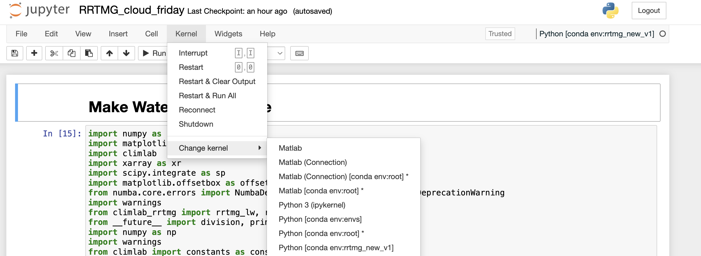

# RRTMG In-class Lab 

Hello! This the assignment for learning how to use RRTMG, which is the global climate model version of 
the Rapid Radiative Transfer Model (RRTM). While the original model is written in Fortran, `climlab` provides a 
Python wrapper for RRTMG, which we'll be using in this in-class lab session. 

# About this Repository

There are **three** main files that needed your attention to: 
- README.md
- RRTMG_InClass.ipynb
- RRTMG_Pre-class.ipynb

1. `README.md`: Basically this documentation that you are reading right now. **Please follow the instructions to set up the required environment and fetch the notebooks**, and feel free to reach out if you face any difficulty when running the notebooks!
2. `RRTMG_InClass.ipynb`: The working notebook that we will be using on November 17's lecture. Feel free to glance through the text in the notebook to get a better sense of the data and the RRTMG model that we will be working with on Friday. 
3. `RRTMG_Pre-class.ipynb`: A quick 5-minute read - the goal is to breifly have an idea of what simulation output from global climate models would look like, and the lines of code that calls the RRTMG model using the Climlab package. 

<ins>Additional References:</ins>
- inclass_func.py

1. `inclass_func.py`: This is a python script that contains all functions called from `RRTMG_InClass.ipynb` and `RRTMG_InClass_full.ipynb`. All lines of code called from the in-class working notebook are detailed here, including model calls and figure plotting. 

<br/><br/>

# Prior to In-class Session
## A. Installing climlab

We recommend creating a new environment or using an existing non-base environment for this. Here is the one line code to make new environment and install all the necessary libraries 

1. To do this all in one line:
```
conda create --name rrtmg python=3.10 climlab climlab-rrtmg numpy=1.23 numba matplotlib jupyter ipykernel --channel conda-forge
```

This should be fairly straightforward. All dependencies should be installed automatically if they're not already present in your directory. If you want to do line by line there is also instructions for this in the bottom.

2. Then everyone need to activate new environment
```
conda activate rrtmg
```
3. Everyone need to open jupyter notebook in the new environment

## B. Running the code
You can download all the files or ``git clone`` this repo into your home directory by the following line of code, and it should be ready to run!
```
git clone https://github.com/PappuP/RRTMG_ATMS511.git
```

. If you'd like to set up one in Keeling but haven't before, we suggest using [Max Grover's tutorial](https://github.com/mgrover1/keeling-crash-course).

## Line by line instractions of creating environment and libraries 

1. To create a new environment called `rrtmg`:
```
conda create --name rrtmg
```

(Alternative) To copy an environment you already have to make a new one: 
```
conda create --clone [existing environment] -n [new environment] 
```

2. To activate your environment:
```
conda activate rrtmg
```

3. Installing climlab in the new environment:
```
conda install pip 
pip install ipykernel # create a new kernel to run the notebook in 
conda install -c conda-forge climlab matplotlib numba # Download climlab
conda install climlab-rrtmg --channel conda-forge # Download the RRTMG specific package of climlab
```

## C. Debugging: Change the kernel in notebook
If notebook crashes while running,  the steps below are necessary.

1. Install ``nb_conda_kernels`` in your ``base`` environment (i.e. after you typed `bash` + `enter` on Keeling). 

```
conda install -c conda-forge nb_conda_kernels
```

Once this is installed, kernels in all environment that has ipykernel installed will be automatically shown in any notebook running from the base environment (i.e. jupyter notebooks launched in the Keeling login node). 

2. Open Jupyter Notebooks from your base environment and follow the steps below
In the top pannel of the notebook find ``Kernel>>change kernel>>select your new env kernel``



# Resources
- [Climlab](https://climlab.readthedocs.io/en/latest/)
- [Conda cheat sheet](https://docs.conda.io/projects/conda/en/4.6.0/_downloads/52a95608c49671267e40c689e0bc00ca/conda-cheatsheet.pdf)
